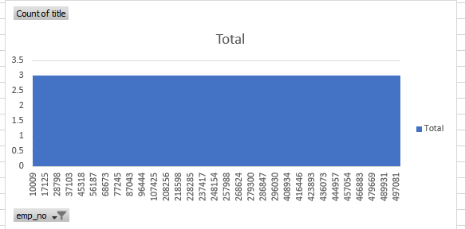

# Pewlett-Hackard-Analysis
## Overview of the analysis:
After assisting Bobby and his manager with creating a number of data bases, we were asked to help Bobby's manager prepare for the
"silver tsunami" within in his department. Bobby's manager will be looking to use this data to manage his growth for several years.

## Results:
We built several data bases which gave us a clearer picture of Bobby's in coming "Silver Tsunami". For example, in 1985 there were 48 Engineer's and Senior Engineer's
who reitred. If you fast forward to 2002 we see a staggering amount of 9906 engineer's and Senior engineer's retiring. Bobby's insight to prepare was corect. 

## 1. Potential loss of valuable knowledge
One of the highlighted areas we were able to identify was the total amount of engineer's and Senior engineers who were retiring who held several positions. 

Our graph shows that there are 2730 individuals who worked up to 3 titles and who were about to retire. The Significance of this data 
allows us to focus on growth opportunities within several departments and allows a focus on cross departamnetal training for the up and coming leaders within the company. 

## 2. Great oportunity in Mentorship
We took a look at the total amount to who were eligible for mentorship and again we learned several things that were of value to Bobby. 
in 1985, there were 350 indivdual who were engeeer's and sSeniors engineers who were eligible for mentorship. That number changed dramitcally in 2002 to 56
That shows us that there were a decline in preperation for future leaders. 

## 3. Clearer view of Retiree's
Another finding in our data showed not only were the individuals who had worked several titles create opoprtunity for mentorship but also showed an error in the total of retiree's. We found that although the overal number showed total of retirees we had not taken into accoutn that some individuals were counted as retired because they moved from one title to another. Because of this finding, our data proved to be off. However, we did learn the need of having the individuals who had held several titles be a part of future mentorship programs. 

## 4. Longer tenurship
We, also found that although there a "Silver Tsunami" on the way the average individual worked at the company for about 5  to 17 years. Because of that, we believe that in order 
to curb future Tsunamies mentorship programs would be a part of the culture from day one. 

## Summary:
We see that there will be many opportunities open up to up and coming leaders within Pewlett Hackard. However, the mentor eligibility is a bit worrisome. 
Many of the employees will be qualified and prepared to take over leadership positions. If done correctly the experience and expertise will be passed on by the retiree's.
There are 2 thoughts that one should take away. What titles are we foscused on as we prepare for mentorship and How much experience will we have left once our Silver Tsunami begins ? 

How many roles will need to be filled as the "silver tsunami" begins to make an impact?
Are there enough qualified, retirement-ready employees in the departments to mentor the next generation of Pewlett Hackard employees?
